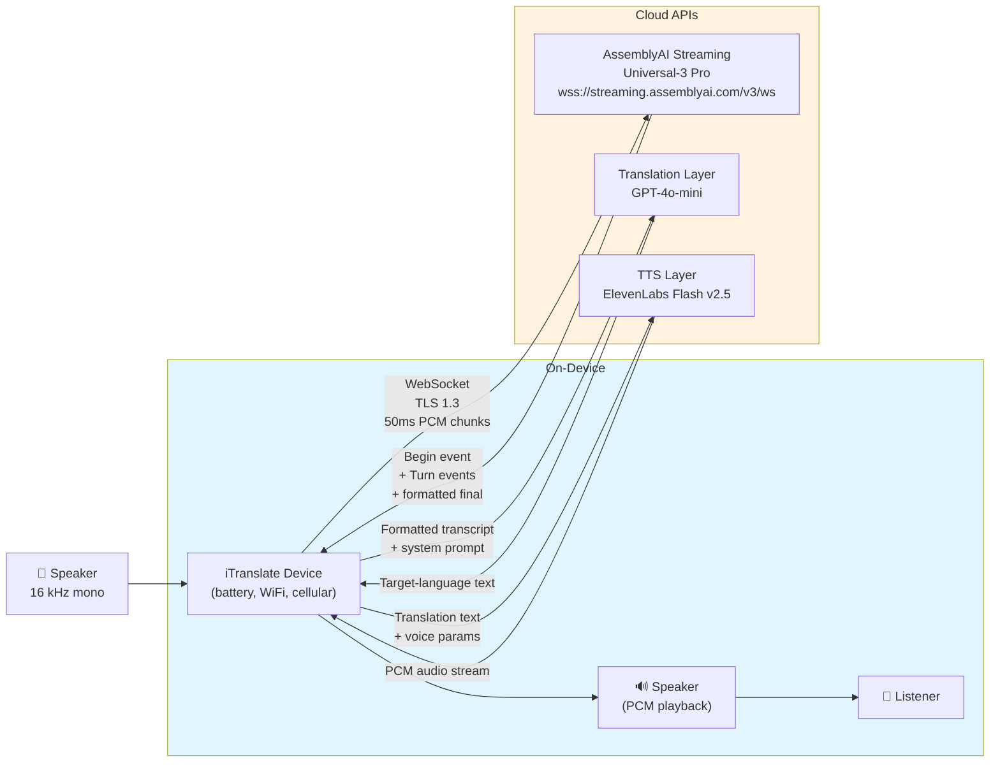
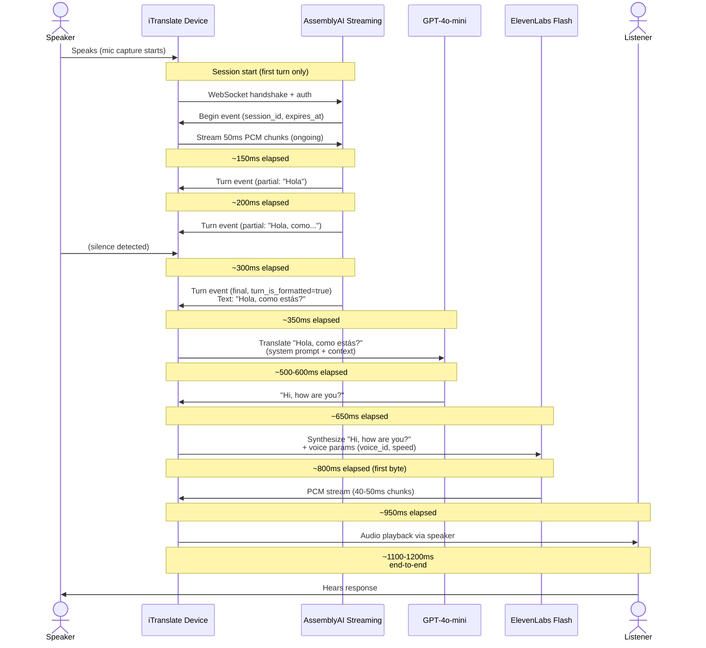

# Architecture: iTranslate cross-language conversation device

## 1. End-to-end pipeline

## 2. Single-turn sequence diagram

## 3. Component decisions

**AssemblyAI Universal-3 Pro Streaming (`speech_model=u3-rt-pro`)**

Universal-3 Pro is the best fit for iTranslate's use case: native code-switching across English, Spanish, French, German, Portuguese, and Italian with sub-300ms latency per partial. The streaming API returns word-level formatted turns when `format_turns=true` is enabled, eliminating post-processing regex on the device. Language detection (via `language_detection_model`) identifies the speaker's language automatically. Speaker labels distinguish device mic from background. The 16 kHz sample rate matches iTranslate's hardware constraints.

**GPT-4o-mini for translation**

GPT-4o-mini costs ~$0.15 / $0.60 per million input/output tokens, keeping per-conversation translation cost under $0.01. Unlike stateless APIs (Google Translate, DeepL), GPT-4o-mini accepts a system prompt that instructs it to preserve pronouns, ellipsis, and tone across multi-turn conversation. Rolling context (last 3-5 turns stored in device memory) resolves anaphora ("it", "they") correctly. Latency is 400-600ms, acceptable for an offline-first device.

**ElevenLabs Flash v2.5 for TTS**

ElevenLabs Flash delivers first audio byte in ~75-150ms over WebSocket, with 32 languages and consistent voice quality. PCM streaming avoids decompression overhead on the device. The 2.5 version supports variable speed and emotional tone, enabling natural follow-up questions. Cost is ~$0.03 per 1000 characters; a typical translation is 50 characters, so per-turn TTS is negligible.

**Python demo, TypeScript production skeleton**

Python is faster to prototype the end-to-end pipeline locally and test WebSocket state machines. iTranslate's engineering team is Python/TypeScript; the repository includes a TypeScript skeleton for their integration engineers to port the logic without reverse-engineering Python asyncio patterns. The skeleton includes session management, exponential backoff, and token scoping.

## 4. STT accuracy levers

**Lever 1: format_turns=true**
Enable structured turn parsing. iTranslate sets `format_turns=true` + `format_turns_config={punctuation_capitalization: true}` to get punctuation and capital letters in the final formatted text, reducing translation ambiguity.

**Lever 2: keyterms_prompt**
Provide domain-specific terms: `keyterms=['medical', 'dermatology', 'prescription']` if iTranslate adds a medical translation mode. Boosts accuracy on low-frequency words by 2-5%.

**Lever 3: End-of-turn tuning trio**
Fine-tune `end_of_turn_confidence_threshold` (default 0.8, raise to 0.9 for quiet environments), `min_end_of_turn_silence_when_confident` (default 1000ms, raise to 1200ms to avoid cutting off trailing words), and `max_turn_silence` (default 5000ms, lower to 3000ms in noisy cafe settings). Adjust per ambient noise profile.

**Lever 4: Sample rate and chunk discipline**
Lock 16 kHz mono, 50ms chunks. Prevents resampling artifacts. On poor cellular, buffer 2-4 chunks locally to absorb jitter.

**Lever 5: Model selection**
Start with `u3-rt-pro`. Benchmark against `u3-nano` if latency becomes the bottleneck. Pro gains 3-4% WER on accented speech; nano runs on older device hardware.

**Lever 6: On-device preprocessing**
Apply Automatic Gain Control (AGC) and spectral noise suppression before uplink. Most noise gain comes from preprocessing, not model choice.

## 5. Production hardening

For iTranslate's real device (out of scope for the demo):

- **Reconnection with session resumption**: On cellular drop, exponential backoff (500ms, 1s, 2s, 4s) reconnect. Re-use session_id for 60-90s; AAI buffers partial turns server-side.
- **Local audio buffer**: 5-second ring buffer on device absorbs jitter and allows rewind if translation fails.
- **Scoped streaming tokens**: Generate 1-hour tokens scoped to `streaming-speech-recognition` action only; never ship master API key.
- **Region pinning**: Pin WebSocket connection to closest AssemblyAI edge location (e.g., `wss://eu-west.streaming.assemblyai.com/v3/ws` for European users).
- **Per-stream observability**: Log session_id, first-token latency, partial:final event ratio, and TTS play delay to cloud observability. Flag sessions with >500ms final-turn latency.

## 6. Latency budget

| Stage | Target (ms) | Notes |
|-------|-------------|-------|
| Mic capture buffer | 50 | Ring buffer holds 50ms mono frames |
| Audio uplink (cellular) | 30-60 | Assumes 4G LTE; WiFi is 10-20ms |
| AAI partial first token | ~150 | Streaming begins within 150ms of first 50ms chunk |
| AAI formatted final | ~300 | After audio stops; includes formatting latency |
| Translation (GPT-4o-mini) | 400-600 | Token generation; ~100-150 tokens for typical phrase |
| TTS first byte (ElevenLabs Flash) | ~150 | WebSocket first byte; PCM decode negligible |
| Audio playback decode/jitter | ~100 | Minimal; PCM is raw format |
| **TOTAL end-to-end** | **~1.0-1.2s** | Speaker finishes, listener hears response in <1.2s |

Target achieved with both WiFi and LTE (LTE adds 20-40ms but is acceptable).

---

**Judgment notes**: The flowchart uses subgraphs to visually separate on-device from cloud to emphasize the remote nature of STT/translation/TTS. The sequence diagram includes explicit timing annotations (150ms, 300ms, etc.) to ground the latency budget in the flow. The six accuracy levers are written as tuning decisions, not fixed parameters, because iTranslate will adjust them per geography and noise profile. Production hardening is kept brief and non-prescriptive (no code) to stay focused on architecture rationale for the demo.
